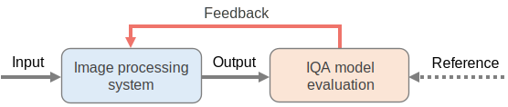

# Perceptual Optimization of Image Quality Assessment (IQA) Models

## Read this first
For the CS230 Project we have used this repo to calculate the image quality assessment scores for original vs up-sampled 
images. To do this for our use case we need to scale the original images to the factor by which they were up-sampled. 
For e.g. if we up-sampled by 3x , we scale the original image using ffmpeg to 3x the resolution and them compare with 
the up-scaled version of that image. Instructions below:

- The bash scripts are under the "scripts" directory
- Step 1: Run get_resolutions_for_all_files_in_folder.sh first, this will create a CSV with a mapping between file in 
  the "input_directory" (which should be path to up-scaled images) and their resolutions.
- Step 2: Run change_batch_resolution.sh with parameter resolution_filename_mapping_path which is basically path to 
  file generated in Step 1, this will upscale the original images 
- Step 3: ENV should be setup for this prior. I use conda. Run score_images_using_algos.sh to score the images 

This repository re-implemented the existing IQA models with PyTorch, including
- [SSIM](https://www.cns.nyu.edu/~lcv/ssim/), [MS-SSIM](https://ece.uwaterloo.ca/~z70wang/publications/msssim.html), [CW-SSIM](https://www.mathworks.com/matlabcentral/fileexchange/43017-complex-wavelet-structural-similarity-index-cw-ssim),
- [FSIM](https://sse.tongji.edu.cn/linzhang/IQA/FSIM/FSIM.htm), [VSI](https://sse.tongji.edu.cn/linzhang/IQA/VSI/VSI.htm), [GMSD](https://www4.comp.polyu.edu.hk/~cslzhang/IQA/GMSD/GMSD.htm),
- [NLPD](https://www.cns.nyu.edu/~lcv/NLPyr/), [MAD](http://vision.eng.shizuoka.ac.jp/mod/url/view.php?id=54),
- [VIF](https://live.ece.utexas.edu/research/Quality/VIF.htm),
- [LPIPS](https://github.com/richzhang/PerceptualSimilarity), [DISTS](https://github.com/dingkeyan93/DISTS).

**Note:** The reproduced results may be a little different from the original matlab version.

#### Installation:
- ```pip install IQA_pytorch```

#### Requirements: 
- Python>=3.6
- Pytorch>=1.2

#### Usage:
```python
from IQA_pytorch import SSIM, GMSD, LPIPSvgg, DISTS
D = SSIM(channels=3)
# Calculate score of the image X with the reference Y
# X: (N,3,H,W) 
# Y: (N,3,H,W) 
# Tensor, data range: 0~1
score = D(X, Y, as_loss=False) 
# set 'as_loss=True' to get a value as loss for optimizations.
loss = D(X, Y, as_loss=True)
loss.backward()
```

### DNN-based optimization examples:
- Image denoising
- Blind image deblurring
- Single image super-resolution
- Lossy image compression



For the experiment results, please see [Comparison of Image Quality Models for Optimization of Image Processing Systems
](https://arxiv.org/abs/2005.01338)  

### Citation:
```
@article{ding2020optim,
  title={Comparison of Image Quality Models for Optimization of Image Processing Systems},
  author={Ding, Keyan and Ma, Kede and Wang, Shiqi and Simoncelli, Eero P.},
  journal = {CoRR},
  volume = {abs/2005.01338},
  year={2020},
  url = {https://arxiv.org/abs/2005.01338}
}
```